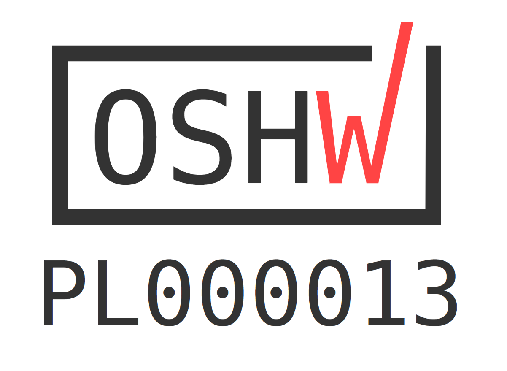
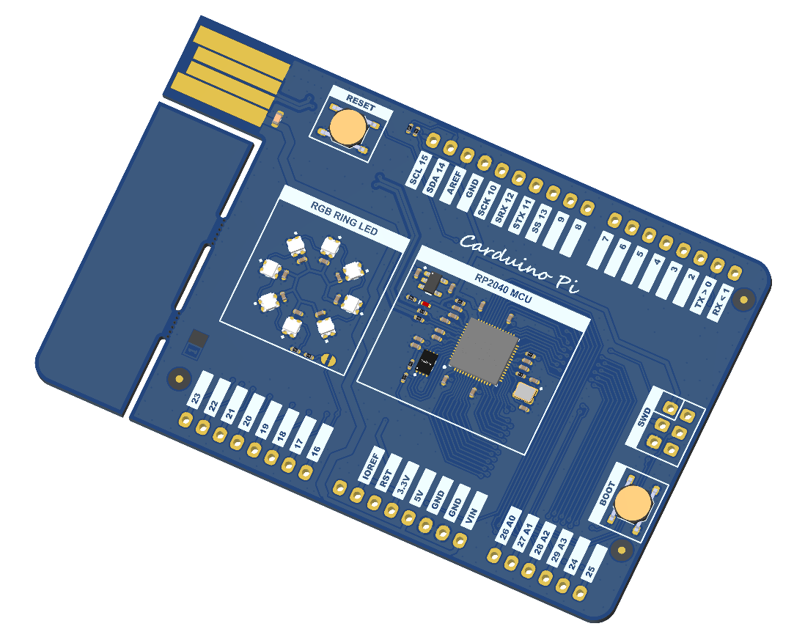
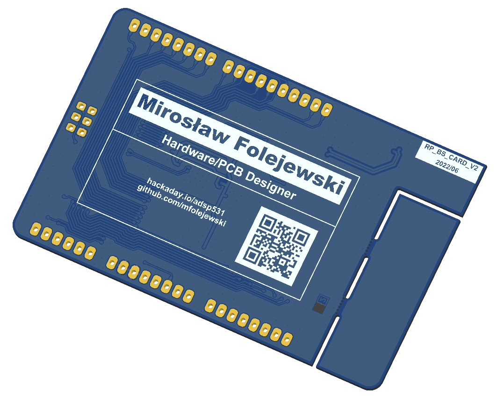

# Carduino Pi - Raspberry Pi RP2040 board with business card form factor and compatible with Arduino Uno

## Description
The equation is very simple:
Business Card + Arduino + Raspberry Pi RP2040 = Carduino Pi
TBD

## License
Project published as Open Source Hardware (OSHW) under CERN OHL v1.2 (Open Hardware Licence).

Project has been certified as Open Source Hardware by the Open Source Hardware Association (OSHWA).

UID is: PL000013

https://certification.oshwa.org/pl000013.html

## Press release
TBD

## Photos

