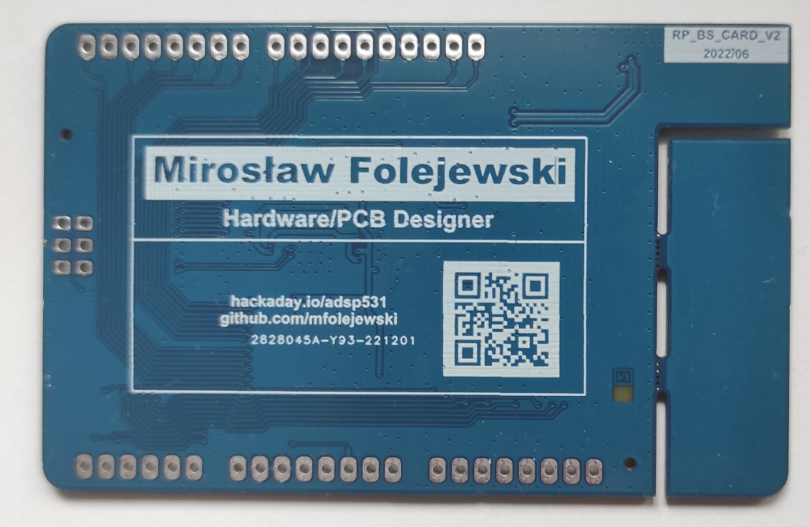

# Carduino Pi - Raspberry Pi RP2040 board with business card form factor and compatible with Arduino Uno

## Description
Carduino Pi is a Raspberry Pi RP2040 evaluation board with business card form factor and compatible with Arduino Uno standard, which has features, as following:
- PCB dimensions: 85,60 x 54,00 mm (ultra flat design, only 0.8mm components height),
- all 30 GPIO pins connected to pin header (Arduino Uno standard with extra 8 GPIO pins),
- 2-layer PCB board,
- onboard: QSPI Flash (USON8 package), 12MHz oscillator, PWR LED,
- RESET/BOOT switches,
- USB interface (PCB edge connector) for debugging MCU and for flashing SPI memory,
- 8x ring LED RGB (WS2812-2020 diodes), 
- fully open source project (OSHW).

The equation is very simple:
Business Card + Arduino + Raspberry Pi RP2040 = Carduino Pi

## License
Project published as Open Source Hardware (OSHW) under CERN OHL v1.2 (Open Hardware Licence).

Project has been certified as Open Source Hardware by the Open Source Hardware Association (OSHWA).

UID is: PL000013

https://certification.oshwa.org/pl000013.html

## Press release
TBD

## Photos

